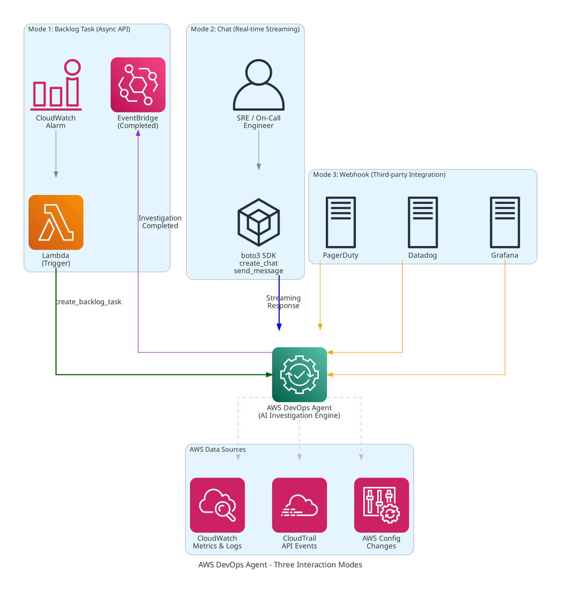
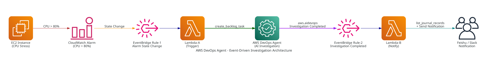
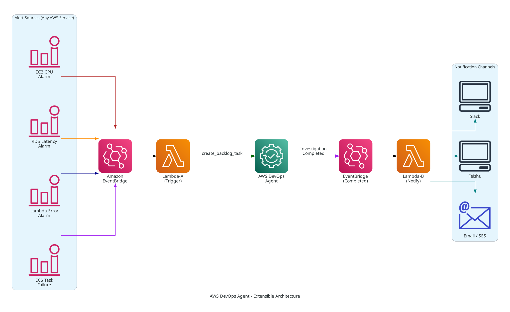

# 基于 AWS DevOps Agent 构建 AI 驱动的自动化运维根因分析系统

> AWS DevOps Agent 是一款 AI 驱动的自主运维代理，能够对 AWS 环境中的各类故障——EC2 异常、RDS 延迟、Lambda 超时、ECS 任务失败、网络连通性问题等——进行自动化根因分析。本文以 **EC2 CPU 告警** 为例，演示如何通过事件驱动架构实现 **告警 → AI 自主调查 → 即时通知** 的全自动闭环，同一架构模式可扩展到任意 AWS 服务的运维场景。

---

## 1. 背景与痛点

随着企业在 AWS 上的工作负载日益复杂——EC2 集群、RDS 数据库、ECS/EKS 容器、Lambda 函数、网络与负载均衡等多种服务交织运行——运维团队面临严峻挑战：

- **告警爆炸**：CloudWatch、第三方监控（Datadog、PagerDuty、Grafana 等）每天产生数百条告警，涉及 CPU、内存、磁盘、网络、错误率等数十种指标，运维团队疲于应对
- **跨服务关联困难**：一个表面的"EC2 CPU 飙升"可能根因在 RDS 慢查询、安全组变更、IAM 权限调整或上游服务故障——人工从 CloudWatch 指标、CloudTrail 操作记录、VPC Flow Logs、Config 变更中逐一关联，效率极低
- **响应延迟**：从告警触发到定位根因，往往需要 30 分钟到数小时，甚至更久。对于生产环境的 P1 故障，每分钟的延误都意味着业务损失
- **知识难以沉淀**：资深工程师的排查经验分散在个人脑海和零散的 runbook 中，团队扩张时知识传递成本高
- **多环境多区域管理**：跨 Region、跨账户的故障排查更加复杂，单靠人工难以全面覆盖

**AWS DevOps Agent** 正是为解决这些运维痛点而生。它是一个 AI 驱动的自主运维代理，能够自动接收来自任何 AWS 服务的告警、跨服务关联数据（CloudWatch 指标、CloudTrail 事件、AWS Config 变更、VPC 网络日志等）、执行深度根因分析，并生成结构化的调查报告——整个过程无需人工干预。

---

## 2. AWS DevOps Agent 产品介绍

### 2.1 什么是 DevOps Agent

AWS DevOps Agent 于 **2025 年 12 月 re:Invent** 大会发布公开预览版（Public Preview），并于 **2026 年 3 月 31 日正式 GA**。它是一款 AI 驱动的自主运维服务，内置了对 AWS 全栈服务的深度理解，能够像一位资深 SRE 工程师一样，自动接收告警、主动收集证据、跨服务关联分析，并输出结构化的根因分析报告。GA 版本还新增了对 **Azure 云环境**和**本地基础设施**（通过 MCP 协议）的支持。

### 2.2 核心能力

| 能力 | 说明 |
|------|------|
| **全栈服务分析** | Agent 自动构建应用拓扑（Application Topology），动态发现并映射 AWS 账户中的资源及其依赖关系。无需预先指定服务列表，Agent 能自动调用相关 AWS API 收集指标、日志和配置信息。GA 版本还支持 Azure 和本地环境（通过 MCP） |
| **AI 自主调查** | 接收告警后 Agent 自主决定调查策略——先查什么、再查什么、如何关联——无需预定义 runbook。调查范围涵盖 CloudWatch 指标与日志、CloudTrail 操作记录、代码仓库、CI/CD 流水线数据、部署历史等 |
| **深度根因分析** | 不仅识别"发生了什么"，更能分析"为什么发生"——从表面症状追溯到根因，给出修复建议。例如：CPU 飙升 → 分析进程行为 → 追踪到 SSM 会话中的异常工作负载 → 建议升级实例类型 |
| **结构化输出** | 调查结果以 Markdown 格式的 Journal Records 保存，包含症状（Symptom）、发现（Finding）、观测数据（Observation）、调查缺口（Gap）和最终摘要（Summary），便于归档和审计 |
| **事件驱动集成** | 调查生命周期通过 EventBridge 发布事件（Investigation Created / Priority Updated / In Progress / Completed / Failed、Mitigation In Progress / Cancelled），可与任何下游系统无缝对接 |
| **多种触发方式** | 支持 API 调用（`create_backlog_task`）、第三方 Webhook、Chat 实时对话三种方式触发，适应不同运维场景 |
| **丰富的第三方集成** | 原生支持 **Datadog、Dynatrace、New Relic、Splunk、Grafana**（可观测性）、**PagerDuty、ServiceNow**（事件管理）、**GitHub、GitLab、Azure DevOps**（代码/CI-CD）、**Slack**（通知）。还可通过 MCP 协议对接自定义工具 |
| **安全与合规** | Agent 通过 IAM 角色（服务主体 `aidevops.amazonaws.com`）调用 AWS API，所有操作可通过 CloudTrail 审计；调查记录持久保存，满足合规要求 |

### 2.3 Agent Space：逻辑管理单元

DevOps Agent 通过 **Agent Space** 进行管理。Agent Space 是 DevOps Agent 的逻辑管理单元，ARN 格式为 `arn:aws:aidevops:<region>:<account-id>:agentspace/<space-id>`，CloudFormation 资源类型为 `AWS::DevOpsAgent::AgentSpace`。每个 Agent Space 可以：
- 关联一个或多个 AWS 账户，通过跨账户 IAM 角色实现多账户调查
- 注册第三方服务（PagerDuty、Datadog、Grafana、GitHub 等）接收 Webhook 告警
- 维护独立的调查历史和 Journal Records
- 通过 EventBridge 发布该 Space 内所有调查的生命周期事件
- 支持 Terraform 和 CloudFormation 模板进行基础设施即代码管理

### 2.4 三种交互方式



| 方式 | API | 特点 | 适用场景 |
|------|-----|------|---------|
| **Backlog Task** | `create_backlog_task` | 异步，Agent 自主调查，通过 EventBridge 通知完成 | 自动化运维流水线、CloudWatch/自定义告警触发 |
| **Chat** | `create_chat` + `send_message` | 同步流式响应，支持多轮对话，Agent 实时调用 AWS API | 交互式排查、实时问答、On-Call 辅助 |
| **Webhook** | 第三方 POST 到 webhook URL | Agent 自动接收并智能判断是否需要调查 | 对接 PagerDuty、Datadog、Grafana、GitLab 等 |

### 2.5 覆盖的典型运维场景

DevOps Agent 能够调查的故障类型远不止 EC2 CPU 告警，以下是一些典型场景：

| 场景 | 告警来源 | Agent 调查范围 |
|------|---------|---------------|
| **EC2 实例异常** | CPU/内存/磁盘告警 | 实例指标、进程行为、CloudTrail 操作、安全组变更 |
| **RDS 性能问题** | 连接数/延迟/存储告警 | Performance Insights、慢查询日志、参数组变更、实例规格 |
| **Lambda 执行失败** | 错误率/超时告警 | 函数日志、内存/超时配置、IAM 权限、上下游服务状态 |
| **ECS/EKS 任务异常** | 任务失败/OOM/重启 | 容器日志、资源限制、镜像版本、网络配置 |
| **网络连通性** | VPC/ALB/NLB 告警 | 安全组规则、NACL、路由表、VPC Flow Logs、DNS 解析 |
| **部署故障** | CodeDeploy/Pipeline 失败 | 部署日志、配置变更、回滚历史、健康检查 |
| **安全事件** | GuardDuty/Config 告警 | CloudTrail 异常活动、IAM 权限变更、资源配置漂移 |

> 本文以 **EC2 CPU 告警** 作为演示场景，展示完整的事件驱动架构。同一架构模式可直接适用于上述所有场景——只需调整 EventBridge Rule 的事件匹配模式和 Lambda-A 中的告警解析逻辑即可。

---

## 3. Demo 方案架构

> 以下以 EC2 CPU 告警为例展示完整架构。该架构具有通用性——将 CloudWatch Alarm 替换为任意 AWS 服务的告警源（RDS、Lambda、ECS 等），即可复用同一套事件驱动流水线。

### 3.1 架构图



### 3.2 组件清单

| 组件 | AWS 服务 | 作用 |
|------|---------|------|
| CPU 告警 | CloudWatch Alarms | 检测 EC2 CPU 使用率超过 80% |
| 事件路由 (Rule-1) | EventBridge | 将告警状态变更路由到 Lambda-A |
| 事件路由 (Rule-2) | EventBridge | 将调查完成事件路由到 Lambda-B |
| 调查触发器 | Lambda-A (Python 3.12) | 调用 DevOps Agent 创建调查任务 |
| 通知发送器 | Lambda-B (Python 3.12) | 获取调查结果并发送飞书通知 |
| AI 调查引擎 | AWS DevOps Agent | 自主根因分析（分析指标、日志、CloudTrail） |
| boto3 层 | Lambda Layer | 提供最新 boto3（含 devops-agent 服务支持） |
| 即时通讯 | 飞书 Bot API | 将调查结果推送到团队群 |

### 3.3 数据流（8 步）

| 步骤 | 事件 | 说明 |
|------|------|------|
| 1 | EC2 CPU 飙升 | `stress --cpu 4` 模拟高负载 |
| 2 | CloudWatch Alarm 触发 | CPU > 80% 持续 2 个评估周期，状态 OK → ALARM |
| 3 | EventBridge Rule-1 匹配 | 捕获 `aws.cloudwatch` / `CloudWatch Alarm State Change` 事件 |
| 4 | Lambda-A 触发调查 | 调用 `create_backlog_task(taskType='INVESTIGATION')` |
| 5 | DevOps Agent 自主调查 | 分析 CloudWatch 指标、CloudTrail 事件、EC2 配置（5~15 分钟） |
| 6 | 调查完成事件 | DevOps Agent 发布 `aws.aidevops` / `Investigation Completed` 事件 |
| 7 | Lambda-B 获取结果 | 调用 `list_journal_records()`，提取 `investigation_summary_md` 记录 |
| 8 | 飞书通知 | 将 Markdown 格式的调查摘要发送到飞书群 |

### 3.4 Investigation Completed 事件格式

当调查完成时，DevOps Agent 自动向 EventBridge 默认总线发布以下事件：

```json
{
  "source": "aws.aidevops",
  "detail-type": "Investigation Completed",
  "detail": {
    "version": "1.0.0",
    "metadata": {
      "agent_space_id": "f95eb69d-46e2-48c9-875f-07536fd3b4b2",
      "task_id": "3bb4e347-e040-417c-ac57-b2ce0f2fe3b4",
      "execution_id": "exe-ops1-f5998e4d-4a48-442b-92f8-cadc22d8303f"
    },
    "data": {
      "task_type": "INVESTIGATION",
      "priority": "HIGH",
      "status": "COMPLETED",
      "created_at": "2026-04-07T04:58:05.356Z",
      "updated_at": "2026-04-07T05:04:47.756Z",
      "summary_record_id": "f9072676-5b46-4139-afae-3d7a3762bac9"
    }
  }
}
```

> **注意**：事件源是 `aws.aidevops`（不是 `aws.devops-agent`），IAM action 前缀也是 `aidevops`。

---

## 4. 部署步骤

> 完整部署指南见 [DEPLOY.md](DEPLOY.md)，以下为关键步骤摘要。

### 4.1 环境变量配置

```bash
export AWS_ACCOUNT_ID="<YOUR_AWS_ACCOUNT_ID>"
export AWS_REGION="us-west-2"
export EC2_INSTANCE_ID="<YOUR_EC2_INSTANCE_ID>"
export DEVOPS_AGENT_SPACE_ID="<YOUR_AGENT_SPACE_ID>"
export FEISHU_APP_ID="<YOUR_FEISHU_APP_ID>"
export FEISHU_APP_SECRET="<YOUR_FEISHU_APP_SECRET>"
export FEISHU_CHAT_ID="<YOUR_FEISHU_CHAT_ID>"
```

### 4.2 IAM 角色与权限

创建 Lambda 执行角色，并添加 DevOps Agent 权限：

```bash
# 创建角色
aws iam create-role \
  --role-name DevOpsAgentDemoLambdaRole \
  --assume-role-policy-document file://iam/lambda-role-trust.json

# 添加基础执行权限
aws iam attach-role-policy \
  --role-name DevOpsAgentDemoLambdaRole \
  --policy-arn arn:aws:iam::aws:policy/service-role/AWSLambdaBasicExecutionRole

# 添加 DevOps Agent 权限（注意前缀是 aidevops）
aws iam put-role-policy \
  --role-name DevOpsAgentDemoLambdaRole \
  --policy-name DevOpsAgentAccess \
  --policy-document '{
    "Version": "2012-10-17",
    "Statement": [{
      "Effect": "Allow",
      "Action": [
        "aidevops:CreateBacklogTask",
        "aidevops:ListJournalRecords"
      ],
      "Resource": "*"
    }]
  }'
```

### 4.3 Lambda Layer（最新 boto3）

> **重要**：Lambda 运行时内置的 boto3 **不包含** `devops-agent` 服务，必须通过 Layer 提供最新版本。

```bash
mkdir -p /tmp/boto3-layer/python
pip install boto3 -t /tmp/boto3-layer/python --upgrade
cd /tmp/boto3-layer && zip -r /tmp/boto3-layer.zip python/

aws lambda publish-layer-version \
  --layer-name boto3-latest \
  --zip-file fileb:///tmp/boto3-layer.zip \
  --compatible-runtimes python3.12
```

### 4.4 部署两个 Lambda 函数

**Lambda-A**（触发调查）：

```bash
aws lambda create-function \
  --function-name devops-agent-trigger-investigation \
  --runtime python3.12 \
  --handler lambda_a.lambda_handler \
  --role "arn:aws:iam::${AWS_ACCOUNT_ID}:role/DevOpsAgentDemoLambdaRole" \
  --zip-file fileb://lambda/lambda_a.zip \
  --timeout 30 --memory-size 128 \
  --layers "${LAYER_ARN}" \
  --environment "Variables={DEVOPS_AGENT_SPACE_ID=${DEVOPS_AGENT_SPACE_ID}}"
```

**Lambda-B**（获取结果 + 飞书通知）：

```bash
aws lambda create-function \
  --function-name devops-agent-notify-feishu \
  --runtime python3.12 \
  --handler lambda_b.lambda_handler \
  --role "arn:aws:iam::${AWS_ACCOUNT_ID}:role/DevOpsAgentDemoLambdaRole" \
  --zip-file fileb://lambda/lambda_b.zip \
  --timeout 60 --memory-size 128 \
  --layers "${LAYER_ARN}" \
  --environment "Variables={DEVOPS_AGENT_SPACE_ID=${DEVOPS_AGENT_SPACE_ID},FEISHU_APP_ID=${FEISHU_APP_ID},FEISHU_APP_SECRET=${FEISHU_APP_SECRET},FEISHU_CHAT_ID=${FEISHU_CHAT_ID}}"
```

### 4.5 EventBridge 规则

**Rule-1**：CloudWatch Alarm → Lambda-A

```bash
aws events put-rule \
  --name "DevOps-Agent-Demo-Alarm-To-Lambda" \
  --event-pattern '{
    "source": ["aws.cloudwatch"],
    "detail-type": ["CloudWatch Alarm State Change"],
    "detail": { "alarmName": ["DevOps-Agent-Demo-CPU-High"] }
  }'

aws events put-targets \
  --rule "DevOps-Agent-Demo-Alarm-To-Lambda" \
  --targets "Id=trigger-investigation,Arn=arn:aws:lambda:${AWS_REGION}:${AWS_ACCOUNT_ID}:function:devops-agent-trigger-investigation"
```

**Rule-2**：Investigation Completed → Lambda-B

```bash
aws events put-rule \
  --name "DevOps-Agent-Investigation-Completed" \
  --event-pattern '{
    "source": ["aws.aidevops"],
    "detail-type": ["Investigation Completed"]
  }'

aws events put-targets \
  --rule "DevOps-Agent-Investigation-Completed" \
  --targets "Id=notify-feishu,Arn=arn:aws:lambda:${AWS_REGION}:${AWS_ACCOUNT_ID}:function:devops-agent-notify-feishu"
```

---

## 5. 关键代码解析

### 5.1 Lambda-A：触发调查

Lambda-A 收到 CloudWatch Alarm 事件后，提取告警详情并调用 DevOps Agent API 创建调查任务：

```python
import json
import os
import boto3

DEVOPS_AGENT_SPACE_ID = os.environ["DEVOPS_AGENT_SPACE_ID"]

def lambda_handler(event, context):
    detail = event.get("detail", {})
    state_value = detail.get("state", {}).get("value", "")

    # 仅在 ALARM 状态时触发调查
    if state_value != "ALARM":
        return {"statusCode": 200, "body": f"Skipped: state={state_value}"}

    # 提取告警信息
    alarm_name = detail.get("alarmName", "Unknown")
    reason = detail.get("state", {}).get("reason", "N/A")
    metrics = detail.get("configuration", {}).get("metrics", [])
    instance_id = ""
    if metrics:
        dims = metrics[0].get("metricStat", {}).get("metric", {}).get("dimensions", {})
        instance_id = dims.get("InstanceId", "")

    # 调用 DevOps Agent 创建调查任务
    client = boto3.client("devops-agent", region_name=os.environ.get("AWS_REGION", "us-west-2"))
    response = client.create_backlog_task(
        agentSpaceId=DEVOPS_AGENT_SPACE_ID,
        taskType="INVESTIGATION",           # 任务类型：调查
        title=f"Investigate: {alarm_name} - {instance_id}",
        priority="HIGH",                    # 优先级
        description=f"CloudWatch Alarm '{alarm_name}' triggered.\n"
                    f"EC2 Instance: {instance_id}\n"
                    f"Reason: {reason}\n"
                    f"Please investigate the root cause.",
    )

    task = response["task"]
    # 返回 taskId 和 executionId，调查已异步启动
    return {"statusCode": 200, "body": json.dumps({
        "taskId": task["taskId"],
        "executionId": task["executionId"],
        "status": task["status"],  # PENDING_START
    })}
```

> **要点**：`create_backlog_task` 返回后调查立即异步启动，无需等待。调查完成后 DevOps Agent 会通过 EventBridge 发送通知。

### 5.2 Lambda-B：获取调查结果并通知

Lambda-B 收到 `Investigation Completed` 事件后，调用 `list_journal_records` 获取调查摘要：

```python
def get_investigation_summary(agent_space_id, execution_id):
    """从 DevOps Agent 获取调查摘要"""
    client = boto3.client("devops-agent", region_name="us-west-2")
    response = client.list_journal_records(
        agentSpaceId=agent_space_id,
        executionId=execution_id,
    )

    # 在 records 中找 investigation_summary_md 类型（Markdown 格式）
    for record in response.get("records", []):
        if record.get("recordType") == "investigation_summary_md":
            return record.get("content", "")

    return "No investigation summary available."


def lambda_handler(event, context):
    detail = event.get("detail", {})
    metadata = detail.get("metadata", {})
    agent_space_id = metadata["agent_space_id"]
    execution_id = metadata["execution_id"]

    # 获取调查摘要
    summary = get_investigation_summary(agent_space_id, execution_id)

    # 发送飞书通知（富文本消息）
    token = get_tenant_access_token()
    send_feishu_message(token, FEISHU_CHAT_ID, "post", {
        "zh_cn": {
            "title": "DevOps Agent Investigation Completed",
            "content": [
                [{"tag": "text", "text": f"Task: {metadata['task_id']}"}],
                [{"tag": "text", "text": summary}],
            ]
        }
    })
```

> **要点**：`list_journal_records` 返回多种类型的记录，其中 `investigation_summary_md` 是 Markdown 格式的完整调查摘要，可直接用于通知展示。

### 5.3 Journal Record 类型一览

| recordType | 说明 |
|------------|------|
| `investigation_summary_md` | 完整调查摘要（Markdown 格式） |
| `investigation_summary` | 结构化调查摘要（JSON 格式） |
| `symptom` | 发现的症状 |
| `finding` | 调查发现（含根因） |
| `observation` | 观测数据 |
| `investigation_gap` | 调查中的信息缺口 |
| `message` | Agent 的对话消息 |

---

## 6. 测试验证

### 6.1 测试流程

```
1. stress --cpu 4 --timeout 240     # EC2 上运行 CPU 压测
2. 等待 2-3 分钟                     # CloudWatch 评估告警条件
3. Alarm 触发 → Lambda-A 日志       # 确认 create_backlog_task 成功
4. 等待 5-15 分钟                    # DevOps Agent 执行调查
5. Investigation Completed           # Lambda-B 收到事件
6. 飞书群收到通知                     # 包含完整调查摘要
```

### 6.2 测试结果

我们进行了 3 轮端到端测试，全部成功通过：

| 测试轮次 | 告警时间 (UTC) | 调查耗时 | 摘要长度 | 飞书通知 | 结果 |
|---------|---------------|---------|---------|---------|------|
| Test #1 | 04:58 | 7 分钟 | ~9,500 字符 | 发送成功 | **PASS** |
| Test #2 | 05:13 | 5 分钟 | ~7,400 字符 | 发送成功 | **PASS** |
| Test #3 | 05:27 | 10 分钟 | ~9,800 字符 | 发送成功 | **PASS** |

### 6.3 调查摘要示例

以下是 DevOps Agent 自动生成的真实调查摘要节选：

> **Investigation Summary**
>
> **Symptoms**
>
> DevOps-Agent-Demo-CPU-High alarm triggered on i-07cc5afbf205bc1a0
>
> CloudWatch alarm 'DevOps-Agent-Demo-CPU-High' transitioned to ALARM at 2026-04-07T04:58:02Z. The t3.large instance 'claude code' (i-07cc5afbf205bc1a0) in us-west-2 showed Average CPUUtilization of 88.67% at 04:56 and 100% at 04:57, crossing the 80% threshold.
>
> **Findings**
>
> **Root Cause**: CPU-intensive burst operations from AI coding workload via concurrent SSM sessions
>
> IAM user 'bedrock' was actively operating on instance i-07cc5afbf205bc1a0 via multiple concurrent SSM sessions (4+ sessions opened between 03:55-04:01 UTC) and making rapid Bedrock InvokeModelWithResponseStream API calls. This AI coding workload periodically triggers CPU-intensive burst operations that spike CPU from the ~34% baseline to 100%.
>
> **Recommendations**: The instance's baseline CPU utilization (~47-49%) significantly exceeds the t3.large baseline performance of 30%. Consider upgrading to a compute-optimized instance type (c6i.large or c7i.large) to handle the workload without credit depletion.

> DevOps Agent 不仅识别了 CPU 飙升的直接原因（SSM 会话中的 AI 工作负载），还分析了实例类型不匹配的深层问题，并给出了具体的升级建议。

---

## 7. 进阶：Chat API 实时对话

除了异步的 Backlog Task 方式，DevOps Agent 还提供 **Chat API**，支持实时对话式交互。

### 7.1 基本用法

```python
import boto3

client = boto3.client("devops-agent", region_name="us-west-2")

# 创建聊天会话
chat = client.create_chat(
    agentSpaceId="<YOUR_AGENT_SPACE_ID>",
    userId="my-user",
    userType="IAM",
)
execution_id = chat["executionId"]

# 发送消息并获取流式响应
response = client.send_message(
    agentSpaceId="<YOUR_AGENT_SPACE_ID>",
    executionId=execution_id,
    content="What EC2 instances are running in this account?",
    userId="my-user",
)

# 解析 EventStream
for event in response["events"]:
    if "contentBlockDelta" in event:
        text = event["contentBlockDelta"].get("delta", {}).get("textDelta", {}).get("text", "")
        if text:
            print(text, end="", flush=True)
```

### 7.2 EventStream 事件类型

`send_message` 返回的是一个流式 EventStream，包含以下事件类型：

| 事件类型 | 说明 |
|---------|------|
| `responseCreated` | 响应开始 |
| `responseInProgress` | Agent 正在处理 |
| `contentBlockStart` | 新的内容块开始（文本或工具调用） |
| `contentBlockDelta` | 增量内容：`textDelta`（文本）或 `jsonDelta`（工具调用/结果） |
| `contentBlockStop` | 内容块结束 |
| `heartbeat` | 长时间操作的保活信号 |
| `responseCompleted` | 响应完成 |
| `responseFailed` | 发生错误 |

### 7.3 多轮对话与上下文保持

使用相同的 `executionId` 可以进行多轮对话，Agent 会保持上下文：

```python
# 第一轮：列出实例
response1 = client.send_message(..., content="List all running EC2 instances.")

# 第二轮：基于第一轮结果追问（Agent 记住了之前的实例列表）
response2 = client.send_message(..., content="Which one has the highest CPU?")
```

### 7.4 Chat API 测试结果

| 测试 | 说明 | 事件数 | 工具调用 | 耗时 | 结果 |
|------|------|--------|---------|------|------|
| create_chat | 创建会话 | - | - | <1s | **PASS** |
| send_message | 查询 EC2 实例列表 | 123 | 6x `ec2.describe_instances` | 23.6s | **PASS** |
| 多轮对话 | 追问哪个实例 CPU 最高 | 293 | 19x `cloudwatch.get_metric_statistics` | 51.9s | **PASS** |

> Agent 在多轮对话中展现了强大的上下文能力：第二轮追问时，Agent 记住了第一轮发现的 9 个实例，直接调用 CloudWatch 查询每个实例的 CPU 使用率，无需重新 describe_instances。

---

## 8. 总结

### 8.1 方案价值

| 维度 | 传统方式 | 本方案（DevOps Agent） |
|------|---------|-------|
| **告警响应** | 人工查看 → 手动排查 → 逐个服务面板切换 | 全自动：告警 → AI 跨服务调查 → 即时通知 |
| **根因分析** | 需要逐一查看 CloudWatch、CloudTrail、Config、VPC Logs 等 | Agent 自动关联多维数据，5-15 分钟出结果 |
| **分析深度** | 取决于工程师经验和对特定服务的熟悉程度 | Agent 系统性分析指标、日志、操作记录、配置变更、网络流量 |
| **知识沉淀** | 分散在个人经验和零散的 runbook 中 | 每次调查生成结构化 Markdown 报告（Journal Records），可归档审计 |
| **覆盖范围** | 需要针对不同服务编写不同的排查脚本 | 统一的 Agent 覆盖 EC2、RDS、Lambda、ECS、VPC 等全栈服务 |
| **通知及时性** | 手动通知或仅简单告警信息 | 调查完成后自动推送完整根因分析到飞书/Slack/钉钉 |

### 8.2 适用场景

- **全栈运维团队**：自动化处理 EC2、RDS、Lambda、ECS、网络等各类 AWS 服务告警，大幅减少告警疲劳
- **On-Call 工程师**：收到的不再是简单的"CPU > 80%"，而是完整的根因分析报告——根因是什么、影响范围多大、建议怎么修复
- **DevOps/SRE 流水线**：将 DevOps Agent 集成到 CI/CD 和监控体系中，部署失败自动调查、性能退化自动分析
- **多团队协作**：通过飞书/Slack/Jira 等工具实现调查结果的自动分发，打破团队间信息壁垒
- **安全运营 (SecOps)**：GuardDuty、Config 合规告警触发自动调查，快速评估安全事件影响
- **多区域/多账户管理**：统一的 Agent Space 管理多账户，跨区域故障集中分析

### 8.3 可扩展架构

本文以 EC2 CPU 告警为 Demo，但同一架构可无缝扩展到任意 AWS 服务告警源和多通知渠道：



### 8.4 架构亮点

1. **事件驱动**：所有组件通过 EventBridge 松耦合，易于扩展
2. **异步处理**：Lambda-A 触发调查后立即返回，Lambda-B 在调查完成后才被触发，无资源浪费
3. **无服务器**：全部使用 Lambda + EventBridge，无需管理服务器
4. **通用架构**：本文以 EC2 CPU 告警为例，但同一架构可直接扩展——替换 EventBridge Rule 的事件模式即可接入 RDS、Lambda、ECS 等任意 AWS 服务的告警
5. **多通知渠道**：可以轻松添加 Slack、钉钉、邮件、Jira 等通知目标，Lambda-B 只需增加对应的 API 调用

### 8.5 参考链接

- [AWS DevOps Agent 用户指南](https://docs.aws.amazon.com/devopsagent/latest/userguide/)
- [DevOps Agent EventBridge 事件参考](https://docs.aws.amazon.com/devopsagent/latest/userguide/integrating-devops-agent-into-event-driven-applications-using-amazon-eventbridge-devops-agent-events-detail-reference.html)
- [DevOps Agent boto3 SDK](https://docs.aws.amazon.com/boto3/latest/reference/services/devops-agent.html)
- [本项目 GitHub 仓库](https://github.com/chinapanpan/devops-agent)

---

*本文基于 2026 年 4 月实际部署和测试编写，所有测试数据均为真实环境产出。*
